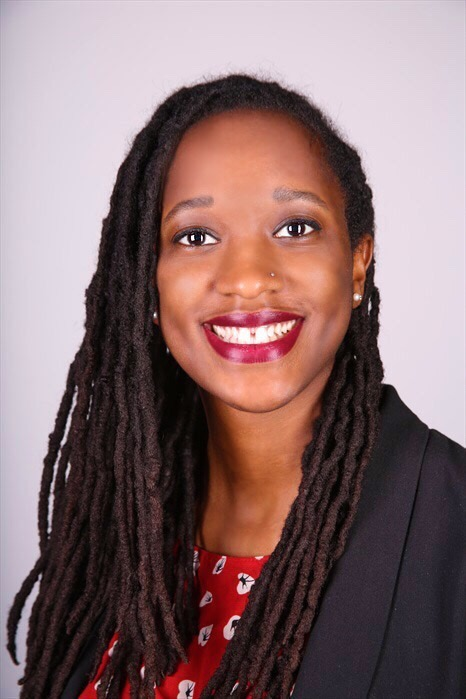

# **Crystal Grant (she/her)**
## Tech Policy Fellow at New America
## Recent Ph.D. grad in Genetics from
## Emory University, Atlanta, GA
### Follow me on [Twitter](http://twitter.com/itscrystalgrant) and/or connect with me on [LinkedIn](https://www.linkedin.com/in/itscrystalgrant/)

&nbsp;

I'm passionate about better understanding the effects of technology on society and I'm especially interested in ensuring the benefits of tech are applied equitably, that the tech workforce reflects the diversity of the population, and that the data used to develop tech tools is free of harmful biases. In May 2020, I graduated from Emory University with my Ph.D. in Genetics and Molecular Biology. In my research, I used bioinformatics tools to characterize the molecular changes in humans with age to better understand the relationship between aging and human health.

I love working to encourage the next generation of data lovers. Throughout my graduate studies, I have: volunteered in K-12 science outreach and education initiatives around Atlanta, taught undergrads how to code as a TA of an intro statistics course, and mentored underrepresented graduate students in STEM. After defending my Ph.D., I worked as a Science and Technology Policy Mirzayan Fellow at the National Academies where I contributed to research policies to increase the number of Women of Color working in tech.

Now that I've finished my PhD, I'm hoping to find a career that allows me to combine my two loves: working with data, and shaping evidence-based policy.
