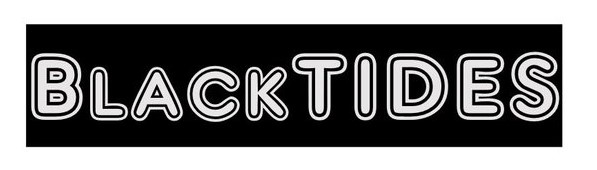
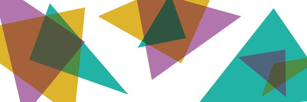
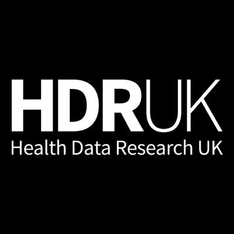
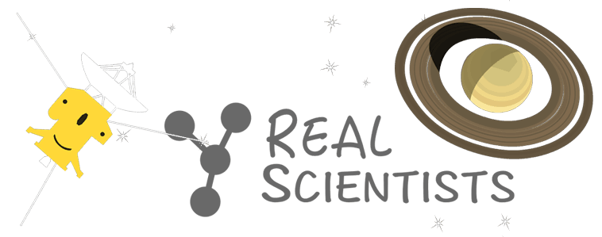
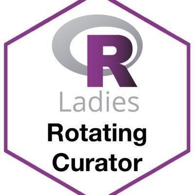

+++
# A Demo section created with the Blank widget.
# Any elements can be added in the body: https://sourcethemes.com/academic/docs/writing-markdown-latex/
# Add more sections by duplicating this file and customizing to your requirements.

widget = "blank"  # See https://sourcethemes.com/academic/docs/page-builder/
headless = true  # This file represents a page section.
active = true # Activate this widget? true/false
weight = 20  # Order that this section will appear.

title = "Get Involved"
subtitle = "To keep up to date with our work, please follow us for updates on [Twitter](https://twitter.com/blkindata). If you think we could work well together, please get in contact at blackindatagroup@gmail.com with your ideas on a partnership. "

[design]
  # Choose how many columns the section has. Valid values: 1 or 2.
  columns = "1"

[design.background]
  # Apply a background color, gradient, or image.
  #   Uncomment (by removing `#`) an option to apply it.
  #   Choose a light or dark text color by setting `text_color_light`.
  #   Any HTML color name or Hex value is valid.

  # Background color.
  # color = "navy"
  
  # Background gradient.
  # gradient_start = "DeepSkyBlue"
  # gradient_end = "SkyBlue"
  
  # Background image.
  #image = ""  # Name of image in `static/img/`.
  #image_darken = 0.3  # Darken the image? Range 0-1 where 0 is transparent and 1 is opaque.

  # Text color (true=light or false=dark).
  #text_color_light = true

#[design.spacing]
  # Customize the section spacing. Order is top, right, bottom, left.
  #padding = ["100px", "200px", "100px", "200px"]

[advanced]
 # Custom CSS. 
   #css_style = "text-align: center"
 
 # CSS class.
 #css_class = ""
+++

## Our partnerships

In Black In Data, we value the partnerships we've made with individuals and organisations. We acknowledge the time and efforts of our partners below in becoming allies of and supporting #BlackInDataWeek. 

                                            ### BlackTIDES

BlackTIDES exists to provide community, and to support the professional growth and technical development of Black professionals in the data space including, but not limited to, technology, informatics, data science, epidemiology and social science industries.

Follow BlackTIDES on [Twitter](https://twitter.com/BlackTIDES1)!

                                            ### Data Visualisation Society
                                            

The Data Visualization Society is an organization dedicated to fostering community for data visualization professionals. 

Connect with [DataVizSociety](https://www.datavisualizationsociety.com/)!

                                            ### Health Data Research UK

 

 Health Data Research UK (HDR UK) is the national institute for health data science with the mission of to uniting the UK's health data to enable discoveries that improve people's lives.

Check out their commitment to diversity [here](https://www.hdruk.ac.uk/diversity-and-inclusion-policy/).

                                            ### Real Scientists

Real Scientists is a rotational Twitter account featuring scientists, researchers, clinicians, writers, communicators and policy makers talking about their lives and their work.

We are doing twitter take-over of [@realscientists](https://twitter.com/realscientists) from 15th-21st (a day before the week begins til the end)! Be sure to tune in for the great commentary from members of our team. 

                                            ### We Are R Ladies

The R-Ladies RoCur (Rotating Curation) is a twitter handle that will feature an awesome R-Lady each week. This account is run by R-Ladies Global. With the objectives of (1) to encourage and maintain Twitter engagement within the R-Ladies community and (2) to spotlight female and minority genders (including but not limited to cis/trans women, trans men, non-binary, genderqueer, agender) and their great work in R.

{} will take over during BID week (Nov 16-20th)  and [Damilola](https://twitter.com/thedamialex) will be taking over the week following BID week (Nov 23-27).

